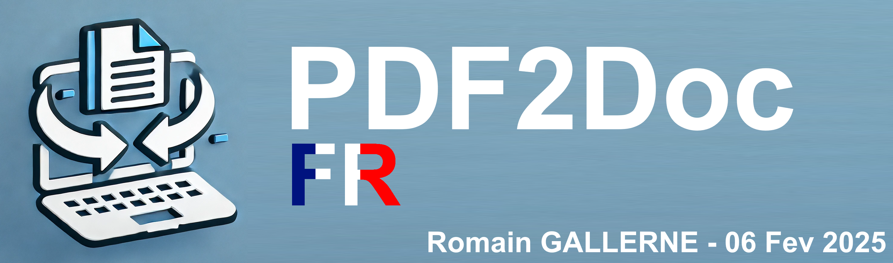

# PDF2Doc FR



**Ce projet permet d'automatiser la traduction de PDF en Anglais vers des documents éditables (docx) en français.**

## Installation rapide
Pour installer toutes les librairies nécessaires :
```bash
pip install -r requirements.txt
```

Il suffit alors de placer les documents à transformer dans le répertoire `docs`. 

Pour lancer la conversion et la traduction des documents, utilisez :
```bash
python src.py
```
Ou bien, sous `Windows`, exécuter le fichier : `windows_run.bat`.
Sous MacOS / Linux, exécute le fichier : `macOS_linux_run.sh`.

> Attention !
> ---
> Gardez à l'esprit qu'il s'agit d'une traduction automatique. Celle-ci peut comporter des erreurs.

## Détails techniques

Traduction : Googletrans
OCR : Docling

# Auteur

Romain Gallerne

# Copyright

CC BY NC-SA
